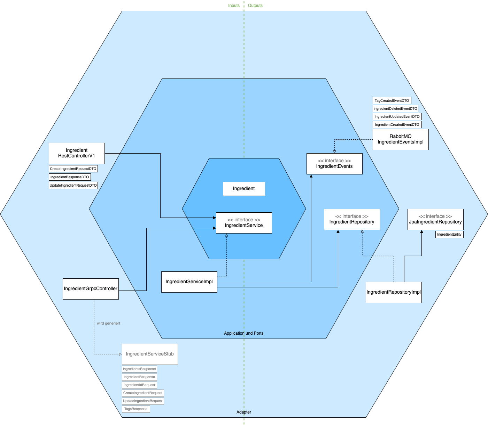

# IngredientService
Der IngredientService ist eine Spring Boot Anwendung, die Zutaten für Rezepte verwaltet.

[](https://sonarcloud.io/summary/new_code?id=THI-CND_ingredient_service)

---

## Architektur



---

## Getting Started
### Dependencies
Das Projekt benötigt die folgenden Abhängigkeiten, um lokal gestartet zu werden:
- Java 17 JDK
- Maven 3+
- Docker
- Docker Compose

### Start
- Projekt lokal bauen:
    ```bash
    mvn clean install
    ```
- Gebautes Projekt lokal starten (Environment Variablen (s. u.) müssen gesetzt sein):
    ```bash
    java -jar target/ingredientservice-<version>.jar
    ```
#### Docker
Das Projekt kann auch lokal per Docker gestartet werden.\
Dazu muss im Projektordner der folgende Befehl ausgeführt werden:
```bash
docker compose up
```
Neben dem Service wird eine Postgres Datenbank und eine RabbitMQ Message Queue gestartet.
Erreichbar ist der Service anschließend unter Port 8080 (REST) und 9090 (gRPC).

### Profile
#### Dev
Im `dev`-Profil wird die Datenbank bei jedem Start geleert.

#### Test
Das `test`-Profil wird zum Ausführen der Tests verwendet.\
Es wird eine lokale H2-Datenbank gestartet, die für die Tests verwendet wird.

---

### Environment Variables
- `DB_URL`: JDBC-URL der Datenbank
- `DB_USER`: Benutzername für die Datenbank
- `DB_PASSWORD`: Passwort für die Datenbank
- `RABBIT_HOST`: Hostname des RabbitMQ Brokers
- `RABBIT_PORT`: Port des RabbitMQ Brokers
- `RABBIT_USER`: Benutzername für RabbitMQ
- `RABBIT_PASSWORD`: Passwort für RabbitMQ
- `RABBIT_EXCHANGE`: Exchange Name für Veröffentlichung der Events in RabbitMQ

---

## APIs
### REST
#### GET /api/v1/ingredients
Gibt alle Zutaten zurück.

**Response:**
- Status: `200 OK`
    ```json
    [
      {
        "id": 1,
        "name": "Mehl",
        "unit": "g",
        "tags": ["vegetarisch", "vegan"]
      },
      ...
    ]
    ```

#### GET /api/v1/ingredients/{id}
Gibt die Zutat mit der ID {id} zurück.

**Response:**
- Status: `200 OK`
    ```json
    {
      "id": 1,
      "name": "Mehl",
      "unit": "g",
      "tags": ["vegetarisch", "vegan"]
    }
    ```
- Status: `404 Not Found`

#### POST /api/v1/ingredients
Erstellt eine neue Zutat.

**Request Body:**

```json
{
  "name": "Mehl",
  "unit": "g",    
  "tags": ["vegetarisch", "vegan"]
}
```
**Response:**
- Status: `201 Created`
    ```json
    {
      "id": 1,
      "name": "Mehl",
      "unit": "g",
      "tags": ["vegetarisch", "vegan"]
    }
    ```
- Status: `400 Bad Request`: Name existiert bereits.

#### PUT /api/v1/ingredients/{id}
Aktualisiert die Zutat mit der ID {id}.

**Request Body:**

```json
{
  "name": "Mehl",
  "unit": "g",    
  "tags": ["vegetarisch", "vegan"]
}
```

**Response:**
- Status: `200 OK`
    ```json
    {
      "id": 1,
      "name": "Mehl",
      "unit": "g",
      "tags": ["vegetarisch", "vegan"]
    }
    ```
- Status: `404 Not Found`

#### DELETE /api/v1/ingredients/{id}
Löscht die Zutat mit der ID {id}.

**Response:**
- Status: `204 No Content`
- Status: `404 Not Found`

### gRPC
```protobuf
syntax = "proto3";

package de.thi.cnd.ingredientservice;

option java_multiple_files = true;
option java_package = "de.thi.cnd.ingredient";
option java_outer_classname = "IngredientProto";

service IngredientService {
  rpc GetIngredients(Empty) returns (IngredientsResponse);
  rpc GetIngredient(IngredientIdRequest) returns (IngredientResponse);
  rpc CreateIngredient(CreateIngredientRequest) returns (IngredientResponse);
  rpc UpdateIngredient(UpdateIngredientRequest) returns (IngredientResponse);
  rpc DeleteIngredient(IngredientIdRequest) returns (Empty);
  rpc GetTags(Empty) returns (TagsResponse);
}

message Empty {
}

message IngredientsResponse {
  repeated IngredientResponse ingredients = 1;
}

message IngredientResponse {
  int64 id = 1;
  string name = 2;
  string unit = 3;
  repeated string tags = 4;
}

message IngredientIdRequest {
  int64 id = 1;
}

message CreateIngredientRequest {
  string name = 1;
  string unit = 2;
  repeated string tags = 3;
}

message UpdateIngredientRequest {
  int64 id = 1;
  string name = 2;
  string unit = 3;
  repeated string tags = 4;
}

message TagsResponse {
  repeated string tags = 1;
}
```

---

## Events
### ìngredients.created
Wird gesendet, wenn eine neue Zutat erstellt wurde.

**Payload:**
```json
{
  "id": 1,
  "name": "Mehl",
  "unit": "g",
  "tags": ["vegetarisch", "vegan"]
}
```

### ingredients.updated
Wird gesendet, wenn eine Zutat aktualisiert wurde.

**Payload:**
```json
{
  "id": 1,
  "name": "Mehl",
  "unit": "g",
  "tags": ["vegetarisch", "vegan"]
}
```

### ingredients.deleted
Wird gesendet, wenn eine Zutat gelöscht wurde.

**Payload:**
```json
{
  "id": 1,
  "name": "Mehl",
  "unit": "g",
  "tags": ["vegetarisch", "vegan"]
}
```

### ingredients.tags.created
Wird gesendet, wenn ein neuer Tag erstellt wurde.

**Payload:**
```json
{
  "name": "vegetarisch"
}
```


